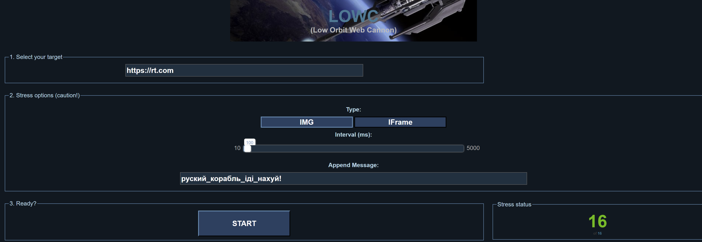

# Low Orbit Web Cannon 

This is JS based Low Orbit Ion Cannon (LOIC) implementation on JS. It requires no installation for stress tester, just launch and forget.

Stress could be pasted as URLs with parameters greatly increasing stress vector. For example via XSS and hidden JS code on a compromised pages forcing visitors to automatically start stress tests.

# Supported parameters

- stressUrl - FQDN or IP to stress. Stress are browser based, so it's only TCP. Port could be pasted after colon. Example: ?stressUrl=https://rt.com
- stressMessage - Appends free text message to the URL being opened. Example: ?stressMessage=руский_корабль_іді_нахуй!
- stressType - supports 2 stress types: 'image' - stressed URL is opened as part of existing page (consume less resources), 'iframe' - harder to detect and creates more stress on stresser and victim. Example: ?stressType=image
- stressInterval - time in milliseconds to repeat opening URL. Default: 200 ms. Example: ?stressInterval=100

# Automated stress tests

In order to start automated stress testing of the URL, passing of stressUrl is enough. This would trigger automatic click of the start button.

Enjoy! 